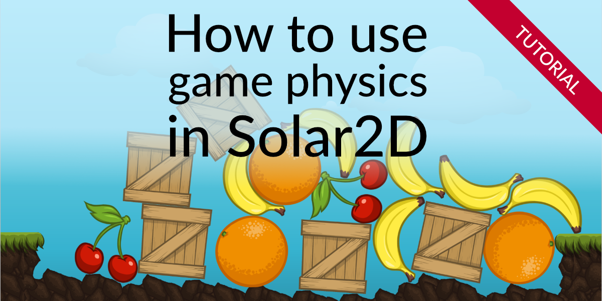

Solar2D Physics Example
=======================

Sample code which demonstrates how to use game physics in Solar2D.
Uses [PhysicsEditor](https://www.codeandweb.com/physicseditor) 
to create complex polygonal collision bodies.

A detailed tutorial can be found here:
[How to use game physics in Solar2D](https://www.codeandweb.com/physicseditor/tutorials/how-to-use-game-physics-in-solar2d).

